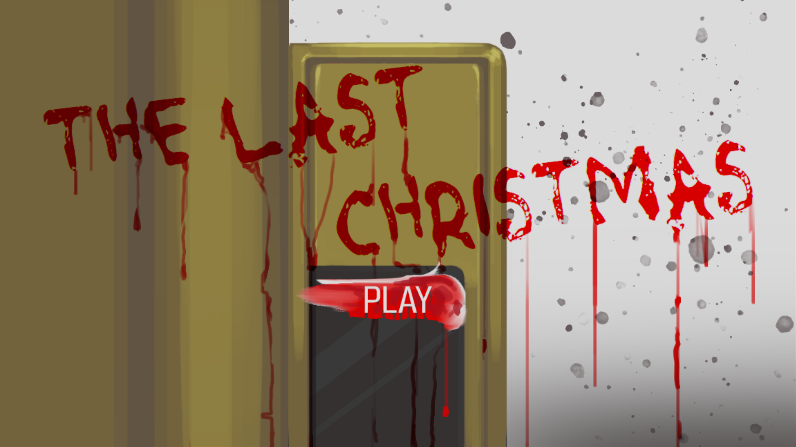
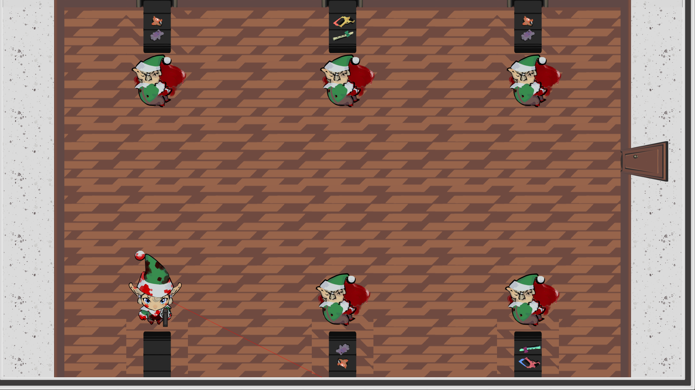
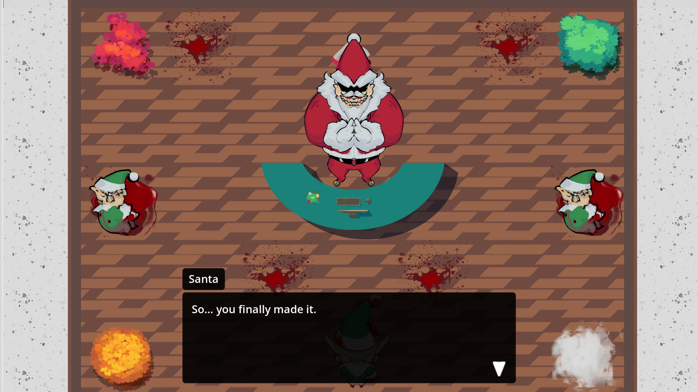

# The Last Christmas 
A short atmospheric horror game developed in 3 days for a Game Jam.

## About the Game 

You play as an overworked elf who has finally snapped under Santa's oppressive rule. Armed with a weapon, your objective is simple: eliminate your fellow elves, solve a quick color-based puzzle, and make your way to a final confrontation with Santa Claus himself.

## Built With 

- Godot Engine 4.3

- GDScript
  
## Screenshots 

 

 

 

## How to Run 

1. Download the project
   
2. Open with Godot (Version 4.3)
   
3. Run the main scene
   
Or 

You can play in Itch.io -> [The Last Chritmas](https://creper70.itch.io/the-last-christmas)
   
## What I Learned 

- Managing scope under extreme time constraints
  
- Rapid prototyping mechanics
  
- Improved understanding of Godot's signal system

## Role

This project was developed in collaboration.

I was responsible for all programming and technical implementation, including gameplay systems, signal architecture and overall game logic.

All art and visual assets were created by Pedro Henrique.
